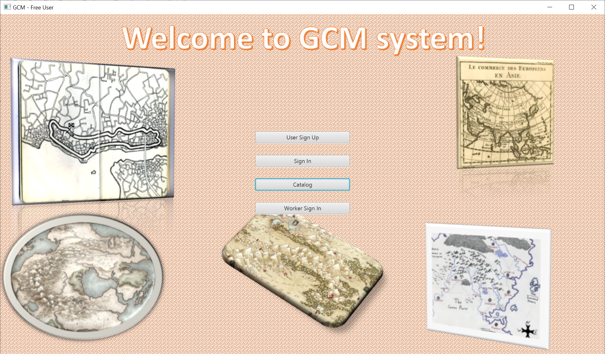
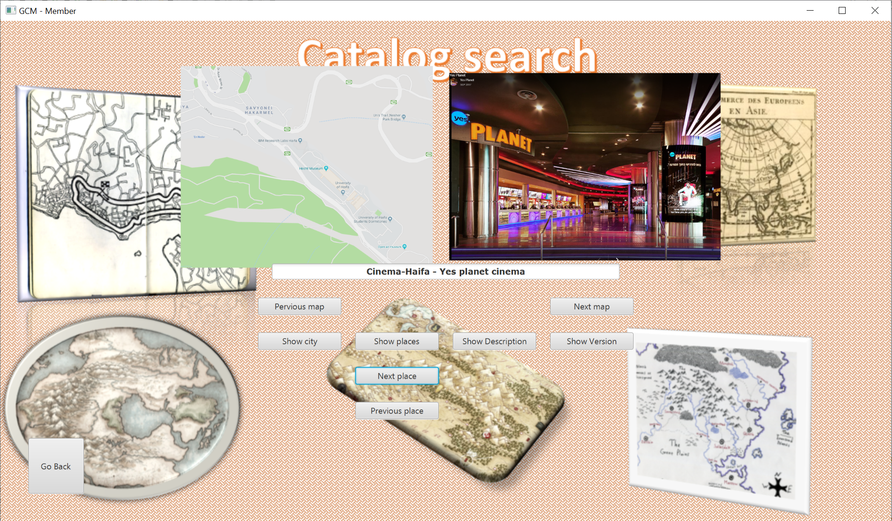
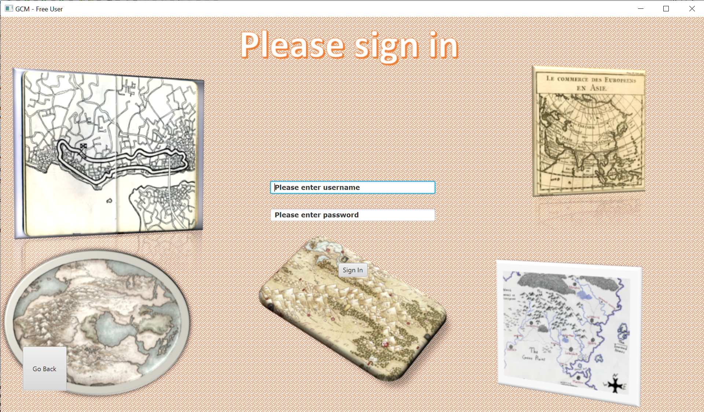

# GCM

## Description
### This repository contains the final project in the course "Software Engineering, 203.3140, Haifa University, Israel"
### GCM stands for "Global City Map" syste, which provides the following:
#### 1. SingUp to the system as users and watch maps and places
#### 2. SingIn to the system as Workers of the system and add/update maps and places
#### 3. SingIn to the system as Managers and watch reports

## Tools&Technology
### Java
### MVC Based
### OCSF for communication
### SQL DataBsae
### JavaFX for Client
### JSON for message parsing

## ScrenShots of the App
##### Main View 

##### Show Map View 

##### SingIn Map View 

##### And there are many more...
